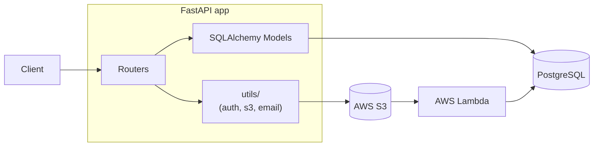

# Architecture

## Overview

A REST API for managing projects and their attached documents. Users register, log in,
create/share projects, and upload/download PDF and DOCX files.

**Stack**: FastAPI · PostgreSQL (SQLAlchemy ORM) · AWS S3 · AWS Lambda · Docker · GitHub Actions  
**Auth**: JWT (HS256, 1 h expiry) — all protected routes use a shared `get_current_user` dependency.  
**Roles**: `owner` (creator, full control) · `participant` (invited, can read/update, cannot delete).  
**Responses**: JSON + standard HTTP status codes; file downloads stream binary content.

---

## System Design



Two meaningful layers inside the app:

| Layer | Files | Does |
|---|---|---|
| **Routers** | `auth.py`, `projects.py`, `documents.py` | Parse requests, run business logic, return responses |
| **Utils** | `auth.py`, `s3.py`, `email.py` | Pure helper functions (JWT, bcrypt, boto3, SMTP) |

SQLAlchemy models and Pydantic schemas are shared across both layers. No separate service layer — the route handlers are simple enough to contain their own logic directly.

---

## API & Access Control

All routes except `POST /auth` and `POST /login` require `Authorization: Bearer <jwt>`.

### Auth

| Method | Path | Auth | Response |
|---|---|---|---|
| POST | `/auth` | — | `201` `{user_id, login}` — `409` login taken |
| POST | `/login` | — | `200` `{access_token, token_type}` — `401` bad credentials |

### Projects

| Method | Path | Required role | Response |
|---|---|---|---|
| POST | `/projects` | any | `201` project created; caller becomes `owner` |
| GET | `/projects` | any | `200` list of accessible projects (details + doc metadata) |
| GET | `/project/<id>/info` | owner or participant | `200` / `403` / `404` |
| PUT | `/project/<id>/info` | owner or participant | `200` updated info |
| DELETE | `/project/<id>` | owner | `204` — cascades to S3 and DB |
| POST | `/project/<id>/invite?user=<login>` | owner | `200` — `404` if user not found |
| GET | `/project/<id>/share?with=<email>` | owner | `200` — emails a `/join?token=…` link to the address |
| GET | `/join?token=<token>` | any (JWT required) | `201` — grants caller `participant` role on the project; `400` if token invalid/expired |

### Documents

| Method | Path | Required role | Response |
|---|---|---|---|
| GET | `/project/<id>/documents` | owner or participant | `200` document list |
| POST | `/project/<id>/documents` | owner or participant | `201` one or more files uploaded |
| GET | `/document/<id>` | owner or participant | redirect to S3 presigned URL (15 min) |
| PUT | `/document/<id>` | owner or participant | `200` file replaced in S3, DB updated |
| DELETE | `/document/<id>` | owner or participant | `204` removed from S3 and DB |

Access control is enforced in each handler by checking the `project_access` table via the DB session.

---

## Data Models

Four tables:

```
users             projects           project_access        documents
─────────         ────────           ──────────────        ─────────
id (PK)           id (PK)            project_id (FK)       id (PK)
login (unique)    name               user_id (FK)          project_id (FK)
password_hash     description        role (owner|parti…)   filename
                  storage_bytes                            s3_key
                                                           size_bytes
```

`project_access` is the join table for the many-to-many user↔project relationship.
Deleting a project cascade-deletes its `project_access` and `documents` rows (DB-level `ON DELETE CASCADE`).

---

## Key Technical Decisions

- **No service layer** — Route handlers query SQLAlchemy models directly via an injected `db` session and call `utils/` helpers. The app is small enough that a service layer adds indirection without benefit. For Phase 2's raw-SQL exercise, handlers can be extended with a second SQL-based implementation.
- **JWT stateless, no revocation** — 1 h expiry per requirements; logout is client-side.
- **S3 presigned URLs for downloads** — The API checks access in DB then returns a 15-min presigned URL. Files never stream through the API server.
- **Share token = short-lived JWT** — `type: "share"` claim, 15 min expiry. No extra DB table needed.
- **Email as a plain function** — `utils/email.py` has a single `send_email(to, subject, body)` call backed by SMTP locally or AWS SES in production, chosen via env var.
- **One `ci.yml`** — lint → test → build image on every push; deploy step runs only on merge to `main`.

---

## File & Folder Structure

```
final_project/
├── app/
│   ├── main.py           # FastAPI app, include routers
│   ├── config.py         # Settings via pydantic-settings (reads .env)
│   ├── dependencies.py   # get_db, get_current_user (FastAPI dependencies)
│   ├── models.py         # SQLAlchemy ORM: User, Project, ProjectAccess, Document
│   ├── schemas.py        # Pydantic request/response schemas
│   │
│   ├── routers/
│   │   ├── auth.py       # POST /auth, POST /login
│   │   ├── projects.py   # /projects and /project/<id>/* routes
│   │   └── documents.py  # /project/<id>/documents and /document/<id> routes
│   │
│   └── utils/
│       ├── auth.py       # hash_password, verify_password, create_token, decode_token
│       ├── s3.py         # upload_file, delete_file, presign_url (boto3 wrappers)
│       └── email.py      # send_email()
│
├── lambda/
│   ├── handler.py        # S3 ObjectCreated/Removed → update storage_bytes in DB
│   └── requirements.txt  # psycopg2-binary, boto3
│
├── tests/
│   ├── conftest.py       # TestClient, test DB session, mocked S3 (moto)
│   ├── test_auth.py
│   ├── test_projects.py
│   └── test_documents.py
│
├── docs/
│   ├── requirements.md
│   └── architecture.md
│
├── .github/workflows/
│   └── ci.yml            # ruff → pytest → docker build (→ deploy on main)
│
├── Dockerfile
├── docker-compose.yml    # app + PostgreSQL (LocalStack for S3 locally)
├── pyproject.toml        # deps, ruff, pytest config
└── .env.example
```

Total: **13 application files** (not counting tests, infra, and config).

---

## Testing Strategy

- `pytest` + FastAPI `TestClient` against a real test DB (in-memory SQLite or throwaway Postgres).
- `moto` to mock S3 for upload/download/delete tests.
- Shared fixtures in `conftest.py`: authenticated client, seeded data, mocked S3 bucket.
- CI runs `ruff check .` then `pytest --cov=app` on every push.

---

## Assumptions

- [ASSUMED] JWT is stateless; no server-side revocation.
- [ASSUMED] Accepted file types: PDF and DOCX (validated by MIME type).
- [ASSUMED] `PUT /document/<id>` replaces the file, not just metadata.
- [ASSUMED] `POST /invite` returns `404` if the target login doesn't exist.
- [ASSUMED] DB schema created via `Base.metadata.create_all()` on app startup. No migration tool.

---

> The CI/CD deploy step will be a commented-out placeholder in `ci.yml` until the deployment
> target is agreed with the mentor. The lint → test → build/push steps are the same regardless of target.
