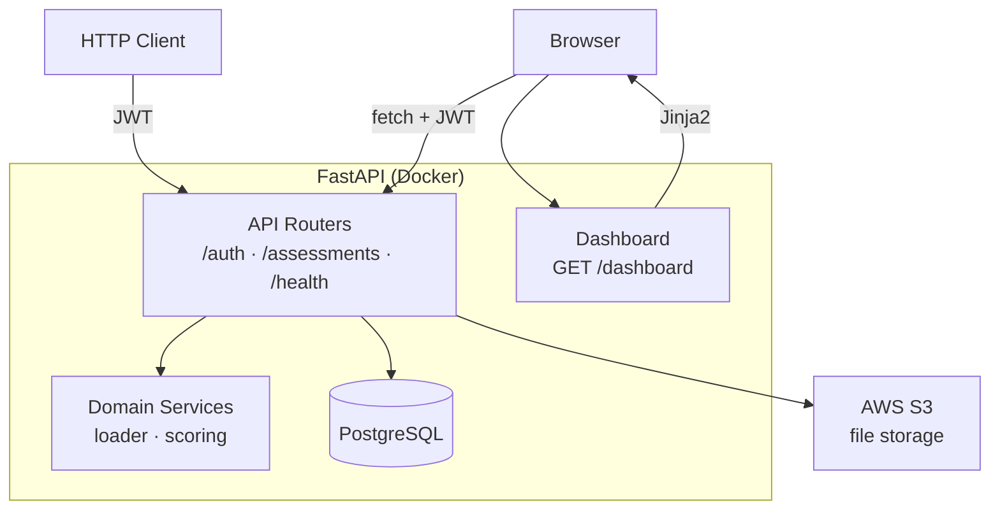
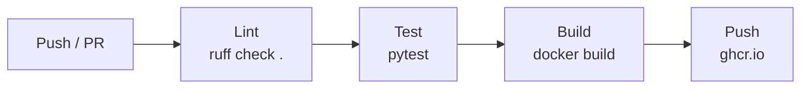

# Architecture — PyMigScore API

## Overview

PyMigScore is a **FastAPI REST API** with two distinct layers:

1. **Routers** — handle HTTP (auth, validation, responses)
2. **Services** — pure-function domain pipeline (scoring, wave assignment)

Routers call services, then read/write to PostgreSQL via SQLAlchemy.
Uploaded CSV files are stored in AWS S3 for record-keeping.
No extra abstraction layers — this is a mentoring project, not a distributed
system.

---

## System Design



---

## Components

| Component | File(s) | What it does |
|---|---|---|
| **App entry point** | `app/main.py` | Creates FastAPI app, configures CORS middleware, registers routers, runs `create_all()` on startup |
| **Settings** | `app/settings.py` | `pydantic-settings` class; `get_settings()` cached dependency |
| **Database** | `app/database.py` | `Base`, `engine`, `SessionLocal`, `get_db()` dependency; ORM models `UserModel`, `AssessmentModel`, `ScoredSystemModel` |
| **Schemas** | `app/schemas.py` | Pydantic v2 models for domain types (`SystemInventory`, `ScoredSystem`, enums) and API request/response shapes |
| **S3 client** | `app/s3.py` | Thin boto3 wrapper: `upload_file(key, data)` and `delete_file(key)` — isolates AWS calls from routers |
| **Auth** | `app/deps.py` | `get_current_user()` FastAPI dependency — decodes JWT, returns `UserModel` or raises `401` |
| **Auth router** | `app/routers/auth.py` | `POST /auth/register`, `POST /auth/login` — hashes passwords, issues JWTs (OAuth2-compatible `username` field) |
| **Assessments router** | `app/routers/assessments.py` | All `/assessments` endpoints — calls services, delegates S3 ops to `app/s3.py`, writes to DB |
| **Health router** | `app/routers/health.py` | `GET /health` |
| **Dashboard router** | `app/routers/dashboard.py` | `GET /dashboard` — serves the Jinja2 HTML template |
| **Dashboard template** | `app/templates/dashboard.html` | Single HTML page with embedded CSS + JS; login form, assessment list, scored-systems table |
| **Domain services** | `app/services/` | Pure functions: no DB, no HTTP (see table below) |

### Domain Services (`app/services/`)

| Module | Function signature |
|---|---|
| `loader.py` | `parse_inventory(data: bytes) -> list[SystemInventory]` — parses and validates the inventory CSV; returns structured JSON errors with row numbers and field names on failure |
| `scoring.py` | `score_systems(systems: list[SystemInventory]) -> list[ScoredSystem]` — computes complexity, cloud_fit, and risk scores using hardcoded weights; derives a weighted composite score; assigns a migration wave (`quick_win`, `standard`, `complex`) based on score thresholds; applies the **6 Rs strategy** (Retire, Repurchase, Retain, Rehost, Replatform, Refactor) based on system attributes and scores; estimates `effort_min` / `effort_max` in person-days |

Services take Pydantic models in, return Pydantic models out. No side effects.

---

## Data Flow

### Create Assessment (POST /assessments → 201)

```
Client → POST /assessments (multipart: CSV + optional name)
  → get_current_user()                # JWT check
  → loader.parse_inventory(csv_bytes) # parse + validate CSV first (structured errors with row numbers)
  → scoring.score_systems(systems)    # score + wave + effort + 6 Rs strategy
  → s3.upload_file(key, csv_bytes)    # store file in S3 (only after validation)
  → db.add(AssessmentModel)
  → db.add_all(ScoredSystemModel rows)
  → db.commit()
  ← 201 {full assessment with scored systems}

  ⚠ On db.commit() failure:
    → catch exception
    → s3.delete_file(key)             # compensating action — remove orphaned file from S3
    ← 500 {error: "..."}
```

### Read / Delete

```
GET /assessments          → db.query(AssessmentModel).filter_by(user_id=...).all()
GET /assessments/{id}     → db.get(AssessmentModel, id) + joined ScoredSystemModels
DELETE /assessments/{id}  → owner check → s3.delete_file(assessment.s3_key)
                          → db.delete(assessment) [cascade]
```

### Dashboard (GET /dashboard → HTML)

```
Browser → GET /dashboard
  ← Jinja2 renders dashboard.html (static page, no server data needed)

Once loaded, JS in the page:
  → POST /auth/login (user enters credentials in a form)
  → stores JWT in localStorage
  → GET /assessments (fetch with Authorization header)
  → renders assessment list in the page
  → on click: GET /assessments/{id}
  → renders scored systems table
```

---

## Key Decisions

- **No repository layer** — Routers use `db: Session = Depends(get_db)` and
  call SQLAlchemy directly. A repository layer would add abstraction with no
  benefit at this scale.
- **Services are pure functions** — No DB, no HTTP inside services. Easy to
  test in isolation.
- **Flat file layout** — Everything in `app/` as flat files, not nested
  sub-packages. 
- **S3 for file storage, not for processing** — The CSV is stored in S3 for
  record-keeping. The scoring pipeline reads from the uploaded bytes directly,
  not from S3.
- **`create_all()` on startup** — No Alembic initially. Alembic is added as a
  separate follow-up step.
- **Hardcoded scoring weights** — No external YAML config. Weights are
  constants in `scoring.py`. Simpler, fewer files, same skill demonstration.
- **Dashboard is Jinja2, not a SPA** — A single HTML template with embedded
  CSS and JS. No build tools, no npm, no frontend framework. The page calls
  the JSON API via `fetch()`. This keeps the project firmly backend-focused.

---

## File & Folder Structure

```
final_project/
├── app/
│   ├── __init__.py
│   ├── main.py              # app factory, router registration, startup
│   ├── settings.py          # pydantic-settings; get_settings()
│   ├── database.py          # Base, engine, SessionLocal, ORM models, get_db()
│   ├── schemas.py           # Pydantic domain types + API request/response
│   ├── deps.py              # get_current_user() JWT dependency
│   ├── s3.py                # boto3 wrapper: upload_file(), delete_file()
│   ├── routers/
│   │   ├── __init__.py
│   │   ├── auth.py          # POST /auth/register, POST /auth/login
│   │   ├── assessments.py   # all /assessments routes
│   │   ├── dashboard.py     # GET /dashboard — serves template
│   │   └── health.py        # GET /health
│   ├── templates/
│   │   └── dashboard.html   # single-page dashboard (embedded CSS + JS)
│   └── services/
│       ├── __init__.py
│       ├── loader.py        # CSV parsing + validation
│       └── scoring.py       # scoring + wave assignment + effort
├── tests/
│   ├── conftest.py          # db, client, auth_client, sample_inventory_csv
│   ├── test_auth.py
│   ├── test_assessments.py
│   ├── test_health.py
│   ├── test_dashboard.py
│   └── test_services/
│       ├── test_loader.py
│       └── test_scoring.py
├── .github/
│   └── workflows/
│       └── ci.yml           # ruff → pytest → docker build → push
├── Dockerfile
├── docker-compose.yml       # app + postgres + localstack
├── pyproject.toml
└── README.md
```

---

## Testing Strategy

| Layer | Approach |
|---|---|
| Domain services | Pure unit tests — no DB, no HTTP. Pass Pydantic models in, assert models out. |
| API endpoints | `httpx.TestClient` with PostgreSQL 16 instance via testcontainers (ephemeral Docker container). Covers all success + error paths. |
| S3 integration | `moto` mocks S3 in tests. No real AWS calls. |
| Linting | `ruff check .` in CI. |

**Fixtures** (`conftest.py`): `db` (testcontainers PostgreSQL engine, creates all tables, yields session, drops/rolls back after suite), `client` (TestClient with overridden `get_db`), `auth_client` (pre-registered + logged-in user with JWT in headers), `sample_inventory_csv` (temporary CSV with valid test data), `mock_s3`.

---

## CI/CD Pipeline



Three-stage GitHub Actions workflow. Stages run sequentially; a failure in any
stage stops the pipeline.

---

## Assumptions

- Testcontainers provides PostgreSQL 16 in tests (ephemeral Docker container); PostgreSQL for docker-compose.
- Wave thresholds are constants in `scoring.py`.
- Scoring weights are hardcoded (no external config).
- LocalStack provides S3 in local development.
